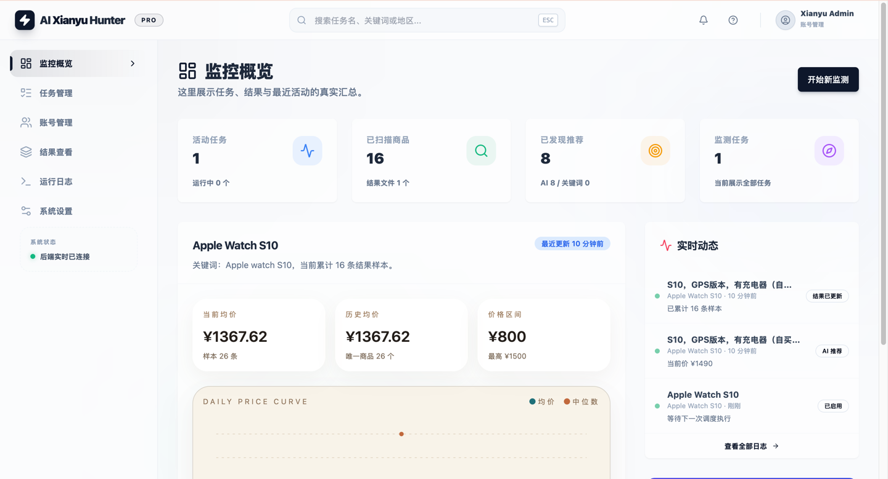
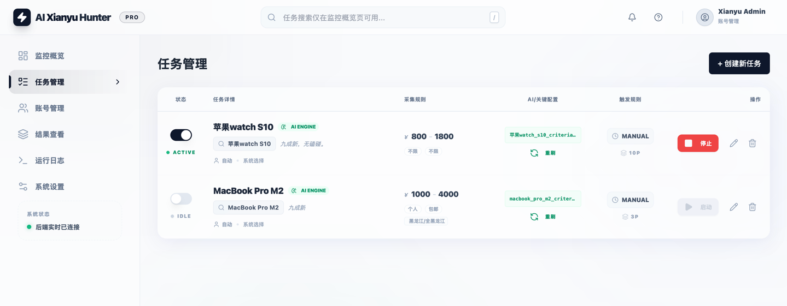
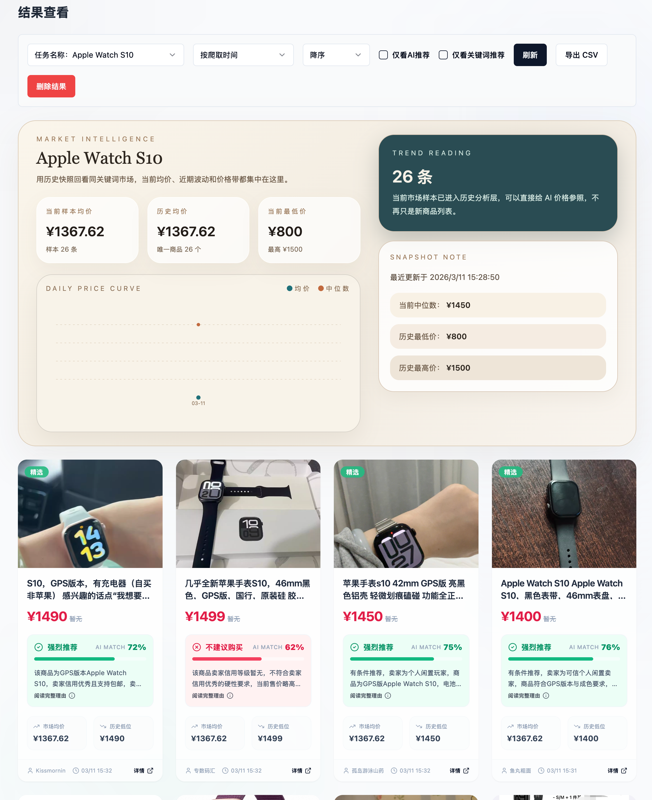

# ai-goofish-smart-monitor

> 鏈粨搴撲互 `Usagi-org/ai-goofish-monitor` 涓哄簳搴ц繘琛屼簩娆″紑鍙戯紝淇濈暀鍏?Web 绠＄悊銆佸浠诲姟銆佽处鍙风鐞嗐€丄I 鏍囧噯銆佹棩蹇椾笌缁撴灉娴忚鑳藉姏锛涙湰鍒嗘敮棰濆鍔犲叆閽夐拤 ActionCard 鍥炬枃鍗＄墖銆佹寜閽寲閾炬帴銆佸叏鍝佺被鍛藉悕涓庡悗缁瘎鍒?闄嶄环鎻愰啋鎵╁睍鍏ュ彛銆?

[涓枃] 锝?[English](README_EN.md)

鍩轰簬 Playwright 鍜?AI 鐨勯棽楸煎浠诲姟瀹炴椂鐩戞帶锛屾彁渚涘畬鏁寸殑 Web 绠＄悊鐣岄潰銆?

## 鏍稿績鐗规€?

- **Web 鍙鍖栫鐞?*锛氫换鍔＄鐞嗐€佽处鍙风鐞嗐€丄I 鏍囧噯缂栬緫銆佽繍琛屾棩蹇椼€佺粨鏋滄祻瑙?
- **AI 椹卞姩**锛氳嚜鐒惰瑷€鍒涘缓浠诲姟锛屽妯℃€佹ā鍨嬫繁搴﹀垎鏋愬晢鍝?
- **澶氫换鍔″苟鍙?*锛氱嫭绔嬮厤缃叧閿瘝銆佷环鏍笺€佺瓫閫夋潯浠跺拰 AI Prompt
- **楂樼骇绛涢€?*锛氬寘閭€佹柊鍙戝竷鏃堕棿鑼冨洿銆佺渷 / 甯?/ 鍖轰笁绾у尯鍩熺瓫閫?
- **鍗虫椂閫氱煡**锛氭敮鎸?ntfy.sh銆佷紒涓氬井淇°€侀拤閽夈€丅ark銆乀elegram銆乄ebhook 绛夊娓犻亾
- **閽夐拤鍥炬枃鍗＄墖**锛氬晢鍝佸浘鐗囩疆椤讹紝姝ｆ枃涓嶅爢闀块摼鎺ワ紝搴曢儴鎸夐挳鏌ョ湅鍟嗗搧
- **骞虫粦杩佺Щ涓庢暟鎹繚鐣?*锛氭敮鎸佷粠涓婃父 Usagi 鐗堟湰鍒囨崲鍒版湰浠撳簱锛屽苟鎻愪緵鏈湴閰嶇疆銆佷换鍔°€佺櫥褰曟€併€佺粨鏋滄暟鎹浠?鎭㈠鏂囨。
- **瀹氭椂璋冨害**锛氭敮鎸?Cron 閰嶇疆鍛ㄦ湡鎬т换鍔?
- **璐﹀彿涓庝唬鐞嗚疆鎹?*锛氬璐﹀彿绠＄悊銆佷换鍔＄粦瀹氳处鍙枫€佷唬鐞嗘睜杞崲涓庡け璐ラ噸璇?
- **Docker 閮ㄧ讲**锛氫竴閿鍣ㄥ寲閮ㄧ讲

## 鎴浘





### 閽夐拤绉诲姩绔帹閫佹晥鏋?

![閽夐拤绉诲姩绔帹閫佹晥鏋淽(docs/images/dingtalk-mobile-real.jpg)

## 馃惓 Docker 閮ㄧ讲锛堟帹鑽愶級

> 鏈」鐩熀浜?`Usagi-org/ai-goofish-monitor` 浜屾寮€鍙戙€傞儴缃叉湰鐗堟湰鏃讹紝璇蜂娇鐢ㄤ笅闈㈢殑褰撳墠浠撳簱鍦板潃锛岃繖鏍锋墠鑳藉寘鍚拤閽?ActionCard銆佹寜閽寲閾炬帴銆佸晢鍝佸浘鐗囧崱鐗囧拰椤圭洰鍚嶇瓑瀹氬埗鏀瑰姩銆?

```bash
git clone https://github.com/Hygge8/ai-goofish-smart-monitor.git
cd ai-goofish-smart-monitor
cp .env.example .env
vim .env # 濉啓 AI銆乄eb 鐧诲綍銆侀拤閽夌瓑閰嶇疆椤?
docker compose up -d --build
docker compose logs -f app
```

Windows CMD锛?

```cmd
git clone https://github.com/Hygge8/ai-goofish-smart-monitor.git
cd ai-goofish-smart-monitor
copy .env.example .env
docker compose up -d --build
docker compose logs -f app
```

鍋滄鏈嶅姟锛?

```bash
docker compose down
```

鏇存柊浠ｇ爜骞朵繚鐣欐湰鍦伴厤缃細

```bash
# 鍏堝浠芥湰鍦拌繍琛屾暟鎹?
bash scripts/backup-runtime.sh

# 鎷夊彇鏈€鏂颁唬鐮?
git pull origin main

# 閲嶆柊鏋勫缓骞跺惎鍔?
docker compose up -d --build
```

Windows PowerShell锛?

```powershell
powershell -ExecutionPolicy Bypass -File .\scripts\backup-runtime.ps1
git pull origin main
docker compose up -d --build
```

濡傛灉闀滃儚鏋勫缓鎱紝涔熷彲浠ヤ复鏃朵娇鐢ㄤ笂娓稿畼鏂归暅鍍忥紝浣嗚繖鏍蜂笉浼氬寘鍚湰浠撳簱鐨勯拤閽夊崱鐗囩瓑鑷畾涔変唬鐮侊細

```yaml
services:
  app:
    image: ghcr.io/usagi-org/ai-goofish:latest
```

- 榛樿 Web UI 鍦板潃锛歚http://127.0.0.1:8000`
- Docker 闀滃儚浼氬湪鏈湴鏋勫缓锛屽寘鍚湰浠撳簱鏈€鏂颁唬鐮併€?
- Docker 闀滃儚宸插唴缃?Chromium锛屾棤闇€瀹夸富鏈洪澶栧畨瑁呮祻瑙堝櫒銆?
- 濡傛灉浣犱慨鏀逛簡 `.env` 涓殑 `SERVER_PORT`锛岃鍚屾鏇存柊 `docker-compose.yaml` 閲岀殑绔彛鏄犲皠銆?
- `docker-compose.yaml` 榛樿浼氭妸 SQLite 涓诲簱鎸傝浇鍒?`./data:/app/data`锛屾暟鎹簱鏂囦欢榛樿涓?`data/app.sqlite3`銆?
- 鐩墠榛樿鎸佷箙鍖栬繖浜涚洰褰曪細
  - `.env` 閫氱煡銆丄I銆乄eb 鐧诲綍绛夐厤缃?
  - `data/` SQLite 涓诲瓨鍌紙浠诲姟銆佺粨鏋溿€佷环鏍煎巻鍙诧級
  - `state/` 鐧诲綍鐘舵€?cookie 鏂囦欢
  - `prompts/` 浠诲姟鎻愮ず璇?
  - `logs/` 杩愯鏃ュ織
  - `images/` 鍟嗗搧鍥剧墖涓庝换鍔′复鏃跺浘鐗囩洰褰?
  - `config.json`銆乣jsonl/`銆乣price_history/` 棣栨鍗囩骇鍒?SQLite 鏃剁敤浜庡吋瀹瑰鍏ョ殑鏃ф暟鎹簮

## 鏈湴閰嶇疆涓庝换鍔′繚瀛?

鏈湴浠诲姟銆佺櫥褰曟€併€佺粨鏋滅瓑杩愯鏁版嵁涓嶄細鎻愪氦鍒?GitHub銆傛洿鏂颁唬鐮佸墠寤鸿鍏堝浠斤細

```bash
bash scripts/backup-runtime.sh
```

鎭㈠锛?

```bash
bash scripts/restore-runtime.sh backups/local-runtime-YYYYMMDD-HHMMSS
```

Windows锛?

```powershell
powershell -ExecutionPolicy Bypass -File .\scripts\backup-runtime.ps1
powershell -ExecutionPolicy Bypass -File .\scripts\restore-runtime.ps1 -BackupDir .\backups\local-runtime-YYYYMMDD-HHMMSS
```

杩佺Щ鍜屽浠芥枃妗ｏ細

- 濡傛灉浣?*涔嬪墠閮ㄧ讲鐨勬槸涓婃父 `Usagi-org/ai-goofish-monitor`锛岀幇鍦ㄨ鍒囨崲鍒版湰浠撳簱鐗堟湰**锛岃鐪嬶細[浠庝笂娓?Usagi 鐗堟湰鍒囨崲鍒颁慨澶嶇増](docs/SWITCH_FROM_UPSTREAM.md)
- 濡傛灉浣?*宸茬粡鍦ㄤ娇鐢ㄦ湰浠撳簱锛屽彧鏄棩甯告洿鏂般€佸浠姐€佹仮澶嶆湰鍦伴厤缃拰浠诲姟鏁版嵁**锛岃鐪嬶細[鏈湴閰嶇疆涓庢暟鎹繚瀛樿鏄嶿(docs/LOCAL_DATA_BACKUP.md)

## 鏁版嵁瀛樺偍涓庤縼绉?

- 褰撳墠鍦ㄧ嚎涓诲瓨鍌ㄤ负 SQLite锛岄粯璁よ矾寰?`data/app.sqlite3`銆?
- 鍙€氳繃鐜鍙橀噺 `APP_DATABASE_FILE` 鑷畾涔夋暟鎹簱璺緞锛汥ocker 榛樿璁剧疆涓?`/app/data/app.sqlite3`銆?
- 搴旂敤鍚姩鏃朵細鑷姩寤哄簱寤鸿〃锛屽苟灏濊瘯浠庢棫鐨?`config.json`銆乣jsonl/`銆乣price_history/` 瀵煎叆涓€娆″巻鍙叉暟鎹€?
- `state/`銆乣prompts/`銆乣logs/`銆乣images/` 浠嶇劧鏄枃浠剁郴缁熺洰褰曪紝涓嶅湪 SQLite 涓€?
- 鍟嗗搧鍥剧墖浼氫复鏃惰惤鍒?`images/task_images_<task_name>/`锛屼换鍔＄粨鏉熷悗榛樿浼氭竻鐞嗐€?
- 棣栨鍗囩骇瀹屾垚骞剁‘璁?`data/app.sqlite3` 涓暟鎹纭悗锛屽彲瑙嗛儴缃叉柟寮忓喅瀹氭槸鍚︾户缁繚鐣欐棫鐨?`config.json`銆乣jsonl/`銆乣price_history/` 鎸傝浇銆?

## 鏈€灏戦厤缃?

| 鍙橀噺 | 璇存槑 | 蹇呭～ |
|------|------|------|
| `OPENAI_API_KEY` | AI 妯″瀷 API Key | 鏄?|
| `OPENAI_BASE_URL` | OpenAI 鍏煎鎺ュ彛鍦板潃 | 鏄?|
| `OPENAI_MODEL_NAME` | 鏀寔鍥剧墖杈撳叆鐨勬ā鍨嬪悕绉?| 鏄?|
| `WEB_USERNAME` / `WEB_PASSWORD` | Web UI 鐧诲綍璐﹀彿瀵嗙爜锛岄粯璁?`admin/admin123` | 鍚?|
| `DINGTALK_WEBHOOK` | 閽夐拤鏈哄櫒浜?Webhook锛屽惎鐢ㄩ拤閽夐€氱煡鏃跺～鍐?| 鍚?|
| `DINGTALK_SECRET` | 閽夐拤鏈哄櫒浜哄姞绛?Secret锛屾病鏈夊姞绛惧彲鐣欑┖ | 鍚?|

鍏朵綑閰嶇疆瑙佷笅鏂光€滈厤缃鏄庘€濄€?

## 绗竴娆′娇鐢?

1. 鎵撳紑榛樿 Web UI `http://127.0.0.1:8000` 骞剁櫥褰曘€?
2. 杩涘叆鈥滈棽楸艰处鍙风鐞嗏€濓紝浣跨敤 Chrome 鎵╁睍瀵煎嚭骞剁矘璐撮棽楸肩櫥褰曟€?JSON銆?
3. 鐧诲綍鎬佹枃浠朵細淇濆瓨鍒?`state/` 鐩綍锛屼緥濡?`state/acc_1.json`銆?
4. 杩涘叆鈥滅郴缁熻缃?/ 閫氱煡璁剧疆鈥濓紝濉啓閽夐拤 Webhook 鍜?Secret锛岀偣鍑绘祴璇曘€?
5. 鍥炲埌鈥滀换鍔＄鐞嗏€濓紝鍒涘缓浠诲姟骞剁粦瀹氳处鍙峰悗鍗冲彲杩愯銆?

## 鍒涘缓绗竴涓换鍔?

- `AI鍒ゆ柇`锛氬～鍐欌€滆缁嗛渶姹傗€濓紝鎻愪氦鍚庝細寮瑰嚭鐙珛杩涘害寮圭獥锛屽悗鍙板紓姝ョ敓鎴愬垎鏋愭爣鍑嗐€?
- `鍏抽敭璇嶅垽鏂璥锛氬～鍐欏叧閿瘝瑙勫垯锛屼换鍔′細鐩存帴鍒涘缓锛屼笉缁忚繃 AI 鐢熸垚娴佺▼銆?
- `鍖哄煙绛涢€塦锛氬凡鏀逛负鐪?/ 甯?/ 鍖轰笁绾ч€夋嫨鍣紝鏁版嵁鍩轰簬闂查奔椤甸潰鎶撳彇蹇収鍐呯疆銆?

## 鐢ㄦ埛浣跨敤璇存槑

<details>
<summary>鐐瑰嚮灞曞紑 Web UI 鍔熻兘璇存槑</summary>

### 浠诲姟绠＄悊

- 鏀寔 AI 鍒涘缓銆佸叧閿瘝瑙勫垯銆佷环鏍艰寖鍥淬€佹柊鍙戝竷鑼冨洿銆佸尯鍩熺瓫閫夈€佽处鍙风粦瀹氥€佸畾鏃惰鍒欍€?
- AI 浠诲姟鍒涘缓鏄悗鍙?job 娴佺▼锛屾彁浜ゅ悗浼氭墦寮€鍗曠嫭鐨勮繘搴﹀脊绐椼€?
- 鍖哄煙绛涢€変細鏄捐憲缂╁皬缁撴灉闆嗭紝榛樿鐣欑┖銆?

### 璐﹀彿绠＄悊

- 鏀寔瀵煎叆銆佹洿鏂般€佸垹闄ら棽楸艰处鍙风櫥褰曟€併€?
- 姣忎釜浠诲姟鍙寚瀹氳处鍙凤紝涔熷彲涓嶇粦瀹氬苟浜ょ粰绯荤粺鑷姩閫夋嫨銆?

### 缁撴灉鏌ョ湅涓庤繍琛屾棩蹇?

- 缁撴灉椤靛拰瀵煎嚭鍔熻兘鐜板湪浠?SQLite 鏌ヨ锛屼笉鍐嶇洿鎺ユ壂鎻?`jsonl` 鏂囦欢銆?
- 鏃ュ織椤垫寜浠诲姟灞曠ず杩愯杩囩▼锛屼究浜庢帓鏌ョ櫥褰曟€佸け鏁堛€侀鎺у拰 AI 璋冪敤闂銆?

### 绯荤粺璁剧疆

- 鍙煡鐪嬬郴缁熺姸鎬併€佺紪杈?Prompt銆佽皟鏁翠唬鐞嗕笌杞崲鐩稿叧閰嶇疆銆?
- 閫氱煡璁剧疆涓敮鎸侀拤閽夋満鍣ㄤ汉锛岄拤閽夋秷鎭娇鐢?ActionCard 鍥炬枃鍗＄墖銆?

</details>

## 寮€鍙戣€呭紑鍙?

### 鐜瑕佹眰

- Python 3.10+
- Node.js + npm锛堟湰鍦伴獙璇?`Node v20.18.3` 鍙畬鎴愬墠绔瀯寤猴級
- Playwright CLI 涓?Chromium锛岄娆¤繍琛屽墠寤鸿鎵ц `python3 -m pip install playwright && python3 -m playwright install chromium`
- Chrome / Edge 娴忚鍣紙Linux 鐜涔熷彲浣跨敤 Chromium锛沗start.sh` 浼氬厛妫€鏌ユ祻瑙堝櫒鏄惁瀛樺湪锛?

```bash
git clone https://github.com/Hygge8/ai-goofish-smart-monitor.git
cd ai-goofish-smart-monitor
cp .env.example .env
```

### 涓€閿惎鍔?

```bash
chmod +x start.sh
./start.sh
```

`start.sh` 浼氬厛妫€鏌?Playwright CLI 鍜屾祻瑙堝櫒鍓嶇疆鏉′欢锛涘湪鍓嶇疆鏉′欢婊¤冻鍚庤嚜鍔ㄥ畨瑁呴」鐩緷璧栥€佹瀯寤哄墠绔€佸鍒舵瀯寤轰骇鐗╁苟鍚姩鍚庣銆?

### 鎵嬪姩鍚姩

```bash
# 鍚庣
python -m src.app
# 鎴?
uvicorn src.app:app --host 0.0.0.0 --port 8000 --reload

# 鍓嶇
cd web-ui
npm install
npm run dev
```

- FastAPI 鍚姩鏃朵細鑷姩鍒濆鍖?SQLite锛屽苟鍦ㄩ娆″惎鍔ㄦ椂灏濊瘯瀵煎叆鏃х殑 `config.json/jsonl/price_history`銆?
- `spider_v2.py` 榛樿浠?SQLite 璇诲彇浠诲姟锛涘彧鏈夋樉寮忎紶鍏?`--config <path>` 鏃舵墠浼氳蛋 JSON 閰嶇疆鍏煎妯″紡銆?
- 榛樿鏁版嵁搴撹矾寰勪负 `data/app.sqlite3`銆?
- Vite 寮€鍙戞湇鍔″櫒浼氬皢 `/api`銆乣/auth`銆乣/ws` 浠ｇ悊鍒?`http://127.0.0.1:8000`銆?
- `npm run build` 鍏堢敓鎴?`web-ui/dist/`锛宍start.sh` 鍐嶅鍒跺埌浠撳簱鏍圭洰褰?`dist/`銆?
- FastAPI 璐熻矗鎻愪緵鏍圭洰褰?`dist/index.html` 鍜?`dist/assets/`銆?
- `./start.sh` 榛樿杈撳嚭璁块棶鍦板潃 `http://localhost:8000` 鍜?API 鏂囨。 `http://localhost:8000/docs`銆?

### 娴嬭瘯涓庢牎楠?

```bash
PYTEST_DISABLE_PLUGIN_AUTOLOAD=1 pytest
cd web-ui && npm run build
```

## 閰嶇疆璇存槑

<details>
<summary>鐐瑰嚮灞曞紑甯哥敤閰嶇疆椤?/summary>

### AI 涓庤繍琛屾椂

- `OPENAI_API_KEY` / `OPENAI_BASE_URL` / `OPENAI_MODEL_NAME`锛欰I 妯″瀷鎺ュ叆蹇呭～椤广€?
- `PROXY_URL`锛氫负 AI 璇锋眰鍗曠嫭鎸囧畾 HTTP/SOCKS5 浠ｇ悊銆?
- `RUN_HEADLESS`锛氭槸鍚︿互鏃犲ご妯″紡杩愯鐖櫕锛汥ocker 涓簲淇濇寔 `true`銆?
- `SERVER_PORT`锛氬悗绔洃鍚鍙ｏ紝榛樿 `8000`銆?
- `LOGIN_IS_EDGE`锛氭湰鍦扮幆澧冨彲鍒囨崲涓?Edge 鍐呮牳锛汥ocker 闀滃儚鏈唴缃?Edge锛屽鍣ㄥ唴浼氬浐瀹氫娇鐢?Chromium銆?
- `PCURL_TO_MOBILE`锛氭槸鍚﹀皢 PC 鍟嗗搧閾炬帴杞崲涓虹Щ鍔ㄧ閾炬帴銆?

### 閫氱煡

- `NTFY_TOPIC_URL`
- `GOTIFY_URL` / `GOTIFY_TOKEN`
- `BARK_URL`
- `WX_BOT_URL`
- `DINGTALK_WEBHOOK` / `DINGTALK_SECRET`
- `TELEGRAM_BOT_TOKEN` / `TELEGRAM_CHAT_ID` / `TELEGRAM_API_BASE_URL`
- `WEBHOOK_*`

### 浠ｇ悊杞崲涓庡け璐ヤ繚鎶?

- `PROXY_ROTATION_ENABLED`
- `PROXY_POOL`
- `ACCOUNT_ROTATION_ENABLED`
- `ACCOUNT_STATE_DIR`

</details>

