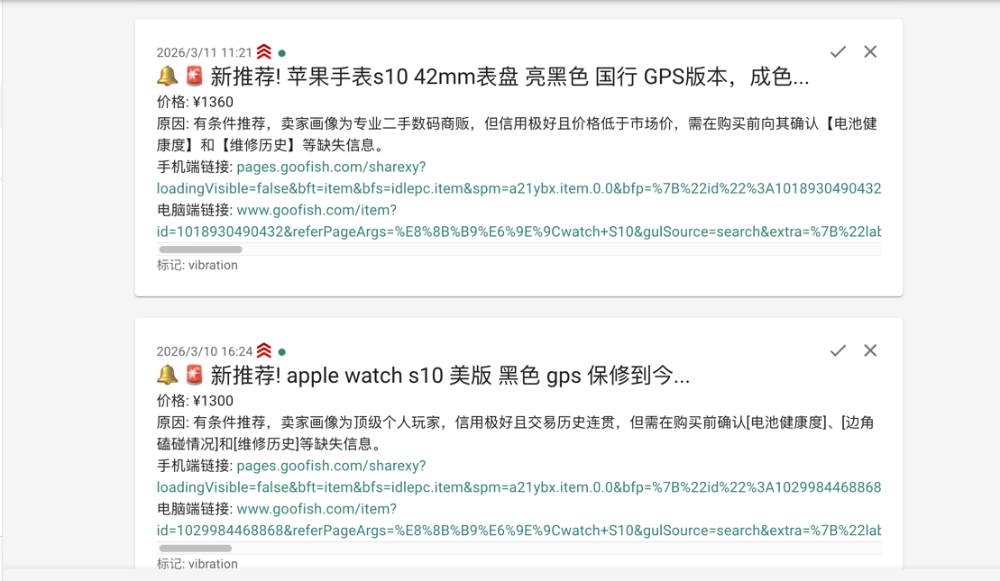

# ai-goofish-smart-monitor

> 本仓库以 `Usagi-org/ai-goofish-monitor` 为底座进行二次开发，保留其 Web 管理、多任务、账号管理、AI 标准、日志与结果浏览能力；本分支额外加入钉钉 ActionCard 图文卡片、按钮化链接、全品类命名与后续评分/降价提醒扩展入口。

[中文] ｜ [English](README_EN.md)

基于 Playwright 和 AI 的闲鱼多任务实时监控，提供完整的 Web 管理界面。

## 核心特性

- **Web 可视化管理**：任务管理、账号管理、AI 标准编辑、运行日志、结果浏览
- **AI 驱动**：自然语言创建任务，多模态模型深度分析商品
- **多任务并发**：独立配置关键词、价格、筛选条件和 AI Prompt
- **高级筛选**：包邮、新发布时间范围、省 / 市 / 区三级区域筛选
- **即时通知**：支持 ntfy.sh、企业微信、钉钉、Bark、Telegram、Webhook 等多渠道
- **钉钉图文卡片**：商品图片置顶，正文不堆长链接，底部按钮查看商品
- **定时调度**：支持 Cron 配置周期性任务
- **账号与代理轮换**：多账号管理、任务绑定账号、代理池轮换与失败重试
- **Docker 部署**：一键容器化部署

## 截图




## 🐳 Docker 部署（推荐）

> 本项目基于 `Usagi-org/ai-goofish-monitor` 二次开发。部署本版本时，请使用下面的当前仓库地址，这样才能包含钉钉 ActionCard、按钮化链接、商品图片卡片和项目名等定制改动。

```bash
git clone https://github.com/Hygge8/ai-goofish-smart-monitor.git
cd ai-goofish-smart-monitor
cp .env.example .env
vim .env # 填写 AI、Web 登录、钉钉等配置项
docker compose up -d --build
docker compose logs -f app
```

Windows CMD：

```cmd
git clone https://github.com/Hygge8/ai-goofish-smart-monitor.git
cd ai-goofish-smart-monitor
copy .env.example .env
docker compose up -d --build
docker compose logs -f app
```

停止服务：

```bash
docker compose down
```

更新代码并保留本地配置：

```bash
# 先备份本地运行数据
bash scripts/backup-runtime.sh

# 拉取最新代码
git pull origin main

# 重新构建并启动
docker compose up -d --build
```

Windows PowerShell：

```powershell
powershell -ExecutionPolicy Bypass -File .\scripts\backup-runtime.ps1
git pull origin main
docker compose up -d --build
```

如果镜像构建慢，也可以临时使用上游官方镜像，但这样不会包含本仓库的钉钉卡片等自定义代码：

```yaml
services:
  app:
    image: ghcr.io/usagi-org/ai-goofish:latest
```

- 默认 Web UI 地址：`http://127.0.0.1:8000`
- Docker 镜像会在本地构建，包含本仓库最新代码。
- Docker 镜像已内置 Chromium，无需宿主机额外安装浏览器。
- 如果你修改了 `.env` 中的 `SERVER_PORT`，请同步更新 `docker-compose.yaml` 里的端口映射。
- `docker-compose.yaml` 默认会把 SQLite 主库挂载到 `./data:/app/data`，数据库文件默认为 `data/app.sqlite3`。
- 目前默认持久化这些目录：
  - `.env` 通知、AI、Web 登录等配置
  - `data/` SQLite 主存储（任务、结果、价格历史）
  - `state/` 登录状态 cookie 文件
  - `prompts/` 任务提示词
  - `logs/` 运行日志
  - `images/` 商品图片与任务临时图片目录
  - `config.json`、`jsonl/`、`price_history/` 首次升级到 SQLite 时用于兼容导入的旧数据源

## 本地配置与任务保存

本地任务、登录态、结果等运行数据不会提交到 GitHub。更新代码前建议先备份：

```bash
bash scripts/backup-runtime.sh
```

恢复：

```bash
bash scripts/restore-runtime.sh backups/local-runtime-YYYYMMDD-HHMMSS
```

Windows：

```powershell
powershell -ExecutionPolicy Bypass -File .\scripts\backup-runtime.ps1
powershell -ExecutionPolicy Bypass -File .\scripts\restore-runtime.ps1 -BackupDir .\backups\local-runtime-YYYYMMDD-HHMMSS
```

详见：`docs/LOCAL_DATA_BACKUP.md`

## 数据存储与迁移

- 当前在线主存储为 SQLite，默认路径 `data/app.sqlite3`。
- 可通过环境变量 `APP_DATABASE_FILE` 自定义数据库路径；Docker 默认设置为 `/app/data/app.sqlite3`。
- 应用启动时会自动建库建表，并尝试从旧的 `config.json`、`jsonl/`、`price_history/` 导入一次历史数据。
- `state/`、`prompts/`、`logs/`、`images/` 仍然是文件系统目录，不在 SQLite 中。
- 商品图片会临时落到 `images/task_images_<task_name>/`，任务结束后默认会清理。
- 首次升级完成并确认 `data/app.sqlite3` 中数据正确后，可视部署方式决定是否继续保留旧的 `config.json`、`jsonl/`、`price_history/` 挂载。

## 最少配置

| 变量 | 说明 | 必填 |
|------|------|------|
| `OPENAI_API_KEY` | AI 模型 API Key | 是 |
| `OPENAI_BASE_URL` | OpenAI 兼容接口地址 | 是 |
| `OPENAI_MODEL_NAME` | 支持图片输入的模型名称 | 是 |
| `WEB_USERNAME` / `WEB_PASSWORD` | Web UI 登录账号密码，默认 `admin/admin123` | 否 |
| `DINGTALK_WEBHOOK` | 钉钉机器人 Webhook，启用钉钉通知时填写 | 否 |
| `DINGTALK_SECRET` | 钉钉机器人加签 Secret，没有加签可留空 | 否 |

其余配置见下方“配置说明”。

## 第一次使用

1. 打开默认 Web UI `http://127.0.0.1:8000` 并登录。
2. 进入“闲鱼账号管理”，使用 Chrome 扩展导出并粘贴闲鱼登录态 JSON。
3. 登录态文件会保存到 `state/` 目录，例如 `state/acc_1.json`。
4. 进入“系统设置 / 通知设置”，填写钉钉 Webhook 和 Secret，点击测试。
5. 回到“任务管理”，创建任务并绑定账号后即可运行。

## 创建第一个任务

- `AI判断`：填写“详细需求”，提交后会弹出独立进度弹窗，后台异步生成分析标准。
- `关键词判断`：填写关键词规则，任务会直接创建，不经过 AI 生成流程。
- `区域筛选`：已改为省 / 市 / 区三级选择器，数据基于闲鱼页面抓取快照内置。

## 用户使用说明

<details>
<summary>点击展开 Web UI 功能说明</summary>

### 任务管理

- 支持 AI 创建、关键词规则、价格范围、新发布范围、区域筛选、账号绑定、定时规则。
- AI 任务创建是后台 job 流程，提交后会打开单独的进度弹窗。
- 区域筛选会显著缩小结果集，默认留空。

### 账号管理

- 支持导入、更新、删除闲鱼账号登录态。
- 每个任务可指定账号，也可不绑定并交给系统自动选择。

### 结果查看与运行日志

- 结果页和导出功能现在从 SQLite 查询，不再直接扫描 `jsonl` 文件。
- 日志页按任务展示运行过程，便于排查登录态失效、风控和 AI 调用问题。

### 系统设置

- 可查看系统状态、编辑 Prompt、调整代理与轮换相关配置。
- 通知设置中支持钉钉机器人，钉钉消息使用 ActionCard 图文卡片。

</details>

## 开发者开发

### 环境要求

- Python 3.10+
- Node.js + npm（本地验证 `Node v20.18.3` 可完成前端构建）
- Playwright CLI 与 Chromium，首次运行前建议执行 `python3 -m pip install playwright && python3 -m playwright install chromium`
- Chrome / Edge 浏览器（Linux 环境也可使用 Chromium；`start.sh` 会先检查浏览器是否存在）

```bash
git clone https://github.com/Hygge8/ai-goofish-smart-monitor.git
cd ai-goofish-smart-monitor
cp .env.example .env
```

### 一键启动

```bash
chmod +x start.sh
./start.sh
```

`start.sh` 会先检查 Playwright CLI 和浏览器前置条件；在前置条件满足后自动安装项目依赖、构建前端、复制构建产物并启动后端。

### 手动启动

```bash
# 后端
python -m src.app
# 或
uvicorn src.app:app --host 0.0.0.0 --port 8000 --reload

# 前端
cd web-ui
npm install
npm run dev
```

- FastAPI 启动时会自动初始化 SQLite，并在首次启动时尝试导入旧的 `config.json/jsonl/price_history`。
- `spider_v2.py` 默认从 SQLite 读取任务；只有显式传入 `--config <path>` 时才会走 JSON 配置兼容模式。
- 默认数据库路径为 `data/app.sqlite3`。
- Vite 开发服务器会将 `/api`、`/auth`、`/ws` 代理到 `http://127.0.0.1:8000`。
- `npm run build` 先生成 `web-ui/dist/`，`start.sh` 再复制到仓库根目录 `dist/`。
- FastAPI 负责提供根目录 `dist/index.html` 和 `dist/assets/`。
- `./start.sh` 默认输出访问地址 `http://localhost:8000` 和 API 文档 `http://localhost:8000/docs`。

### 测试与校验

```bash
PYTEST_DISABLE_PLUGIN_AUTOLOAD=1 pytest
cd web-ui && npm run build
```

## 配置说明

<details>
<summary>点击展开常用配置项</summary>

### AI 与运行时

- `OPENAI_API_KEY` / `OPENAI_BASE_URL` / `OPENAI_MODEL_NAME`：AI 模型接入必填项。
- `PROXY_URL`：为 AI 请求单独指定 HTTP/SOCKS5 代理。
- `RUN_HEADLESS`：是否以无头模式运行爬虫；Docker 中应保持 `true`。
- `SERVER_PORT`：后端监听端口，默认 `8000`。
- `LOGIN_IS_EDGE`：本地环境可切换为 Edge 内核；Docker 镜像未内置 Edge，容器内会固定使用 Chromium。
- `PCURL_TO_MOBILE`：是否将 PC 商品链接转换为移动端链接。

### 通知

- `NTFY_TOPIC_URL`
- `GOTIFY_URL` / `GOTIFY_TOKEN`
- `BARK_URL`
- `WX_BOT_URL`
- `DINGTALK_WEBHOOK` / `DINGTALK_SECRET`
- `TELEGRAM_BOT_TOKEN` / `TELEGRAM_CHAT_ID` / `TELEGRAM_API_BASE_URL`
- `WEBHOOK_*`

### 代理轮换与失败保护

- `PROXY_ROTATION_ENABLED`
- `PROXY_POOL`
- `ACCOUNT_ROTATION_ENABLED`
- `ACCOUNT_STATE_DIR`

</details>
